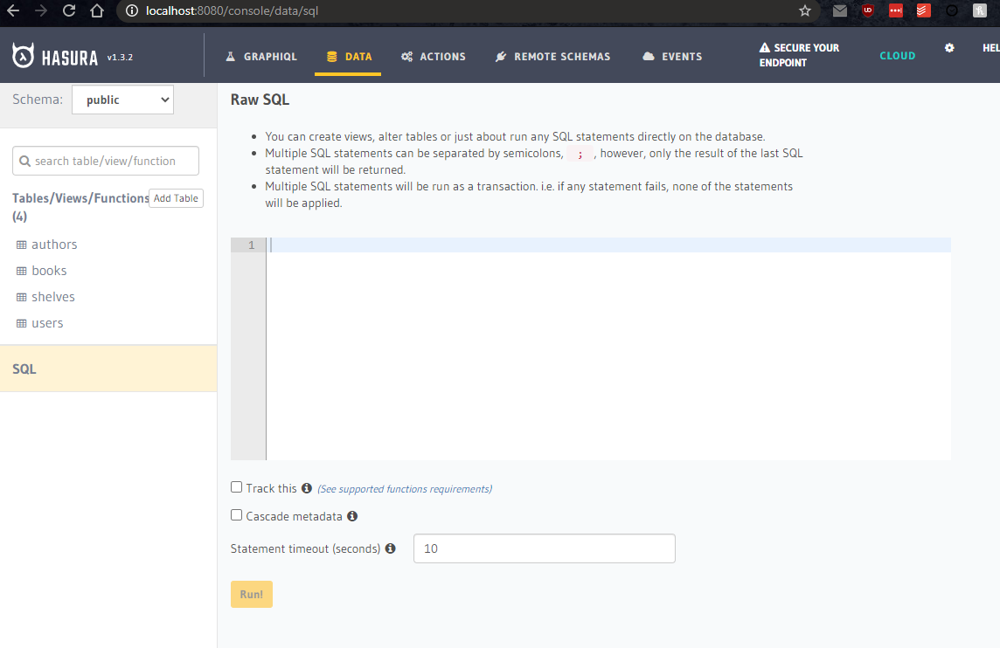

This is a demo Electron to display some of the main functionalities of the framework: running a React app, network interceptors, notifications, dock and tray, auto-update, export to PDF.

If you want to try the release process please fork the repo and try GH Actions on using your own account.

### System Requirements:

- git
- Nodejs ^10 | ^12 | ^14
- npm v6
- windows-build-tools
- docker

### Setup

```bash
git clone https://github.com/kentcdodds/bookshelf.git
cd bookshelf
npm install
```

#### Setup Hasura Backend

1. run `docker-compose up` in the root of the repo.
2. go to _http://localhost:8080_, _Data_ tab and then click on _SQL_ on the left side panel
   
3. paste the contents of `./hasura/structure.sql` inside the SQL query runner, check _Track this_ and then press on _Run_
4. click on the cogwheel icon on the top menu bar and press on _Import metadata_ and then select the `./hasura/hasura_metadata.json` file and upload it. Alternatively, go to _Data_ tab in the top menu bar and track all the relations

#### Run the application in dev-mode

`npm run start-dev`

#### Prepare a distribution installer

`npm run dist`

#### How to do an automatic deployment

- change the version in package.json
- use the same version when creating a tag `git tag v${version}`
- push the tag `git push origin v${version}`
